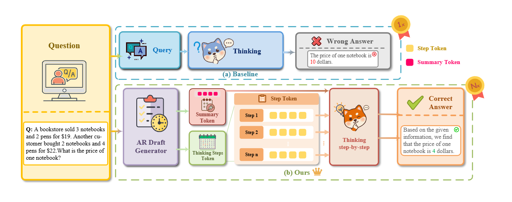
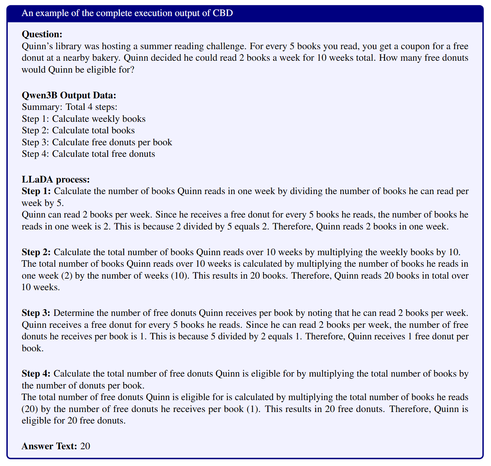
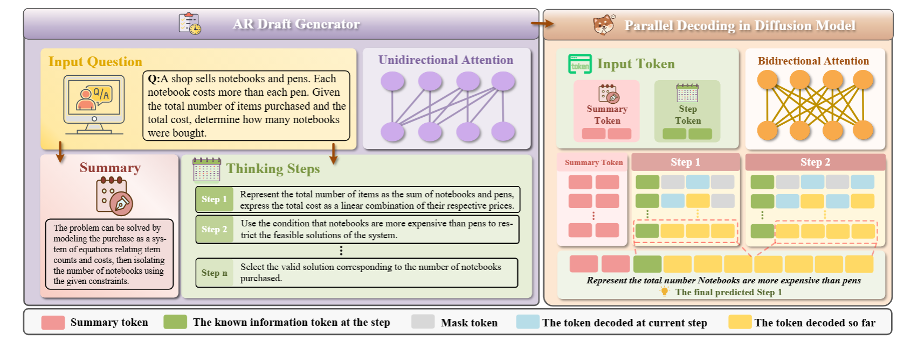
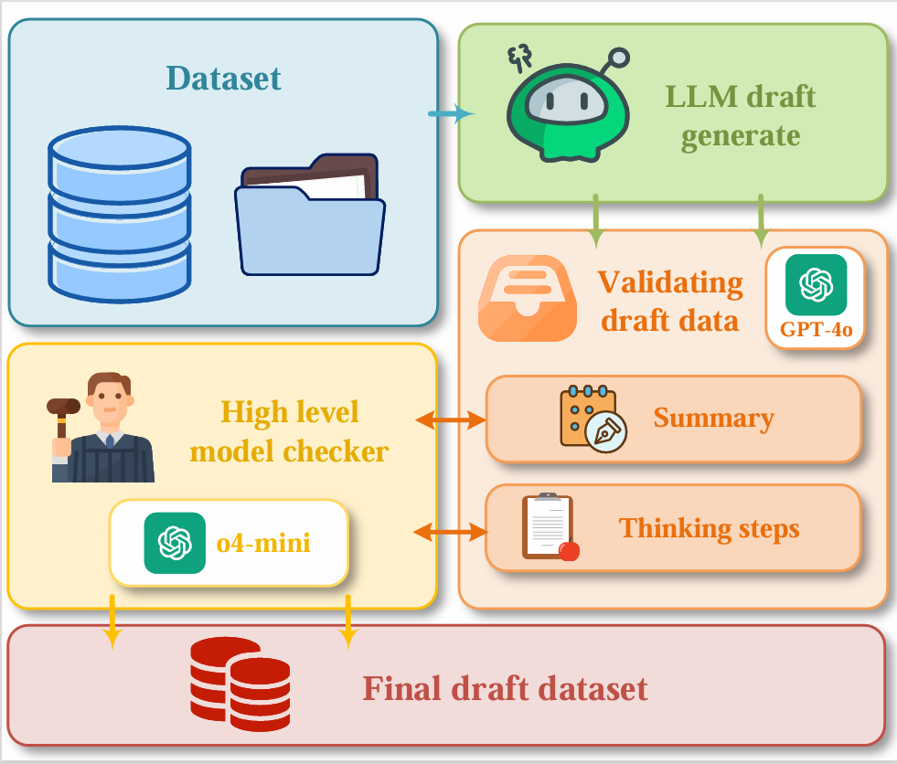

# Cross-dLLM: Cross-Block Diffusion Decoding with Auto-Regressive Drafting for Complex Reasoning


### **Introduction**

Recent advancements in Large Language Models (LLMs) have demonstrated emergent intelligence in complex reasoning tasks, particularly in mathematical problem-solving and logical deduction. The prevailing paradigm primarily relies on Autoregressive (AR) architectures, which decompose complex queries into intermediate reasoning steps via Chain-of-Thought (CoT) reasoning. However, AR models are inherently constrained by strictly sequential decoding, where inference latency scales linearly with sequence length ($\mathcal{O}(N)$). In scenarios requiring long reasoning chains or high-concurrency deployment, this inefficiency constitutes a severe computational bottleneck.

To overcome the limitations of serial generation, discrete diffusion language models have attracted increasing attention due to their intrinsic capacity for parallel computation. By formulating generation as an iterative denoising procedure, diffusion models theoretically permit constant numbers of generation steps. However, existing pure diffusion approaches exhibit substantial difficulty in modeling long range dependencies and complex logical structures. In the absence of explicit causal masking, these models often fail to enforce coherent global semantic planning, which results in logical inconsistencies or hallucinated content. Such shortcomings make them markedly less effective than autoregressive models on precision critical tasks, especially mathematical reasoning.

To balance the fundamental trade-off between inference efficiency and generation quality, we propose a novel hybrid framework, i.e., **Crossed-Block Diffusion (CBD)**. Our core insight lies in decoupling the high-level reasoning process into two distinct phases: Planning and execution. Specifically, we employ a lightweight AR model as a planner to generate sparse yet logically coherent semantic skeletons. Subsequently, a diffusion model acts as an executor, populating high-dimensional textual details in parallel under global skeletal constraints. This design effectively synthesizes the logical coherence of AR models with the local parallel efficiency of diffusion models, realizing a paradigm of global serial planning, local parallel execution.




The primary challenge in realizing this hybrid paradigm lies in the training-inference distribution shift. During training, the model is conditioned on ground truth skeletons, whereas during inference it relies on skeletons predicted by an autoregressive model, which inevitably contain noise or errors. Strict dependence on imperfect drafts can lead to progressive error accumulation. To address this issue, we propose a robust training strategy called Drop-AR, which incorporates noise injection and dynamic conditional dropout. These mechanisms collectively improve the model’s robustness to imperfect drafts and help maintain logical consistency during inference.

To fully leverage parallel computation, we formalize the generation process as confidence based block parallel decoding. Instead of applying uniform denoising, the sequence is divided into semantic blocks according to the model's local confidence, guided by the structural priors provided by the skeleton. This hierarchical scheduling approach helps achieve higher GPU utilization,  while ensuring that generation proceeds from macro structures to micro-level details, respecting semantic dependencies.

We conduct extensive evaluations of CBD on mathematical reasoning benchmarks such as GSM8K and MATH500, as well as on general reasoning tasks including HellaSwag. Empirical results demonstrate that CBD consistently outperforms non-parallel baselines, achieving accuracy improvements of up to 24.7% while simultaneously delivering up to 3$\times$ inference acceleration. Notably, this performance gain is achieved while preserving logical accuracy comparable to strong autoregressive models. These results confirm the promise of the hybrid paradigm for low-latency, high-precision reasoning.

Our main contributions are summarized as follows:
- We propose the **CBD** framework, which effectively combines the logical strengths of autoregressive models with the parallel efficiency of diffusion models through a skeleton planning and parallel filling mechanism.
- We design a noise resilient training strategy that incorporates noise injection and Drop AR, which effectively bridges the training inference distribution gap and equips the diffusion model with self correction capabilities under imperfect conditions.
- We introduce a confidence based block parallel decoding algorithm that uses semantic skeletal priors to guide the parallel denoising process, achieving a superior trade-off between generation quality and inference speed.
- Extensive experiments across multiple challenging benchmarks confirm that CBD enables efficient and robust long chain reasoning even under resource-constrained settings, offering a practical pathway for scalable large model deployment.


### **Code Structure**

Root Directory
├──  qwen_batch/                    # Qwen Batch Processing Module
│   ├── draft_generate_args.py     # Draft Generation Parameters Script
│   ├── qwen_train.py              # Qwen Model Training Main Script
│   ├── qwen_train_args.py         # Qwen Training Parameters Configuration
│   └── qwen_train_run_args.py     # Qwen Training Runtime Parameters Configuration
│
├── eval_llada.py                  # LLaDA Model Evaluation Script
├── eval_llada_stepwise.py         # LLaDA Model Stepwise Evaluation Script
├── ft_llada_final.py              # LLaDA Model Fine-tuning Script (Final Version)
├── generate.py                    # Text Generation Script
├── generate_parallel.py           # Parallel Text Generation Script
└── readme.md                      # Project Documentation

## Usage

### LLaDA Training

You can train the model by running the following command:

```
accelerate launch /path/to/ft_llada_final.py \
    --data_path /path/to/your/train_data.jsonl \
    --model_path /path/to/base_model_directory \
    --output_dir /path/to/output_directory \
    --epochs 3 \
    --batch_size 1 \
    --grad_acc_steps 4 \
    --lora_r 8 \
    --lora_alpha 16 \
    --lora_dropout 0.05

```

**Note:** All model training and inference are performed locally, without relying on external cloud services or remote computing resources.

### Evaluation

To evaluate the trained model, run the evaluation script:

```
PYTHONPATH=/path/to/lm-evaluation-harness \
accelerate launch /path/to/lm-evaluation-harness/lm_eval/__main__.py \
    --model hf \
    --model_args pretrained=/path/to/your/model_directory \
    --tasks gsm8k \
    --batch_size 1
```

### Example Output




### Performance Benchmarks

We evaluate our model (CBD: Draft-Conditioned Parallel Diffusion) against baseline methods on standard reasoning and commonsense datasets. We also include ablation studies on decoding strategies and hyperparameters.

#### Table 1: Comparison with Autoregressive, Diffusion, and Hybrid Baselines

Models are evaluated on GSM8K (Cobbe et al., 2021), MATH500 (Hendrycks et al., 2021), HellaSwag (Zellers et al., 2019), ARC-C, and ARC-E (Zellers et al., 2019). Accuracies are reported in percentage.


| Category                  | Method                          | Backbone (Param) | GSM8K ↑ | MATH500 ↑ | HellaSwag | ARC-C | ARC-E |
|---------------------------|---------------------------------|-----------------|---------|-----------|-----------|-------|-------|
| **Autoregressive Baselines** |                                 |                 |         |           |           |       |       |
| AR                        | Qwen-2.5-7B (Anonymous, 2024)  | 7B              | 80.1    | 45.1      | 55.8      | 54.7  | 77.4  |
| AR                        | Qwen-2.5-3B (Planner)           | 3B              | 66.2    | 36.2      | 50.1      | 52.1  | 70.0  |
| **Diffusion & Hybrid Baselines** |                           |                 |         |           |           |       |       |
| Diff                      | LLaDA-8B (Anonymous, 2025)     | 8B              | 68.4    | 26.1      | 50.6      | 32.1  | 70.5  |
| Diff                      | Dream                           | 7B              | 70.3    | 31.4      | 73.3      | 56.3  | 82.3  |
| Hybrid                    | LaDiR                           | 8B              | 53.9    | 25.4      | –         | –     | –     |
| **Ours (CBD)**            | Full System                     | 3B + 8B         | 72.1    | 36.8      | 51.2      | 56.8  | 71.4  |

**Observation:** CBD achieves a favorable trade-off between parameter efficiency and reasoning performance, surpassing most diffusion-only baselines on mathematical and commonsense tasks.

#### Table 2: Impact of Draft Input and Decoding Strategy

We report strict-match accuracy, latency (relative), and inference time (minutes) on subsets of 20–1000 samples using 4× H100 GPUs. “Parallel Blocks” refers to semantic blocks processed together; average token-level steps are indicated.

| Input Skeleton / Draft          | Decoding Strategy | Parallel Blocks / Avg. Tokens per Step | Strict Match (%) | Latency | Time (min) |
|--------------------------------|-----------------|----------------------------------------|-----------------|---------|------------|
| None                            | Intra-block      | 1                                      | 68.0            | 1.00x   | 293        |
| Rule-based / Pre-generated      | Intra-block      | 1                                      | 84.2            | 0.95x   | 279        |
| Rule-based / Pre-generated      | Intra-block      | 4                                      | 66.4            | 0.47x   | 137        |
| Parallel Skeleton               | Cross-block      | 4 / 3.34                               | 69.3            | 0.34x   | 105        |
| Fine-tuned Parallel Skeleton    | Cross-block      | 4 / 3.34                               | 73.8            | 0.37x   | 125        |
| AR Planner + Parallel Skeleton  | Cross-block      | 4 / 3.34                               | 72.1            | 0.38x   | 128        |

**Key Takeaways:** Fine-tuning the skeleton improves accuracy. Cross-block decoding reduces latency with minimal impact on performance. The AR Planner variant is used in the full system.

#### Table 3: Hyperparameter Overview

Summary of hyperparameters used for Qwen and LLaDA models.

| Category                        | Hyperparameter        | Value / Notes                                               |
| ------------------------------- | --------------------- | ----------------------------------------------------------- |
| **Qwen2.5-3B (Transformer AR)** |                       |                                                             |
| Architecture                    | Attention             | Standard Transformer causal self-attention, SwiGLU-like FFN |
| Decoding                        | Position Encoding     | Causal (left-to-right)                                      |
|                                 | Temperature           | 0.7                                                         |
|                                 | Top-p                 | 0.8                                                         |
|                                 | Repetition penalty    | 1.05                                                        |
| Optimization (Finetuning)       | Max generation tokens | 512                                                         |
|                                 | Optimizer             | AdamW, betas=(0.9,0.98), eps=1e-6                           |
|                                 | Learning rate         | 2e-05                                                       |
|                                 | Batch sizes           | 4                                                           |
| **LLaDA (Masked Diffusion)**    |                       |                                                             |
| Training Hyperparameters        | Epochs                | 3 (SFT)                                                     |
|                                 | LR schedule           | Linear warmup                                               |
|                                 | Batch size            | 4                                                           |
|                                 | Block length          | 1024                                                        |
|                                 | Generation length     | 1024                                                        |
|                                 | Remasking strategy    | Low-confidence remasking                                    |
| **General / Shared**            | Optimizer             | AdamW β₁=0.95, β₂=0.98                                      |
|                                 | LR Scheduler          | Warmup 1000–2000 steps or 0.01–0.4 ratio                    |
|                                 | Activation            | SwiGLU / GELU variants                                      |
|                                 | Max context length    | Qwen: up to 32K                                             |

### **Algorithms and Methodology** 




#### Training Data Preparation

To preserve general reasoning ability and promote cross-task generalization, we incorporate approximately 1k commonsense reasoning instances from OpenBookQA and QASC. These benchmarks align well with diffusion-based decoding, where predictions are formed by aggregating multiple parallel reasoning trajectories. As multiple-choice datasets, each candidate option is typically supported by an independent reasoning path grounded in explicit facts. This structure reduces cross-option dependency and naturally decomposes the decision process into parallel evaluation streams, making them well-suited for training diffusion-based models with parallel inference behavior.

For training data construction, we build a structured, coarse-grained reasoning skeleton $s$ for each instance, serving as the explicit latent plan. Each skeleton contains: (1) a high-level summary capturing the global logical structure, and (2) a sequence of coarse-grained reasoning steps specifying the semantic content and ordering of parallelizable sub-units. We use GPT-4o to generate the structured summaries and steps conditioned on the input question, and validate them with GPT-4o mini to ensure logical consistency. The final training sample is represented as an $(x, s, y)$ triplet, where $x$ is the question, $s$ the reasoning skeleton, and $y$ the target answer. 




#### Problem Formulation: The Hybrid Generative Paradigm

Autoregressive models capture sequential dependencies well, but token-by-token generation incurs linear latency, limiting scalability for complex reasoning. To mitigate this, we model reasoning as a hierarchical latent process by introducing an explicit structural variable $s$ that decouples high-level planning from low-level execution. The semantic skeleton $s$ abstracts surface details while preserving the core logical trajectory.

Given input $x$ and target sequence $y$, we factorize the joint distribution as:

$$
p(y, s \mid x)=\underbrace{p_{\text{AR}}(s \mid x; \phi)}_{\text{Planning (Serial)}}
\cdot
\underbrace{p_{\text{Diff}}(y \mid s, x; \theta)}_{\text{Execution (Parallel)}} .
$$

Here, a lightweight autoregressive model $p_{\text{AR}}(s \mid x; \phi)$ generates the skeleton $s$ sequentially, while a diffusion-based decoder $p_{\text{Diff}}(y \mid s, x; \theta)$ refines it in parallel to produce the final output $y$. This formulation explicitly separates planning and execution, enabling serial high-level reasoning with parallelizable fine-grained generation.


#### Autoregressive Skeleton Planning

In our framework, the skeleton $s$ compactly represents the high-level logical structure of reasoning, serving as a semantic scaffold for parallel execution. It includes a summary of the global trajectory and a sequence of coarse-grained reasoning steps capturing key intermediate actions, while abstracting surface details. This task-agnostic representation links serial planning with parallel execution across datasets.

A lightweight autoregressive model $\mathcal{M}_{\text{AR}}$ parameterizes $p_\phi(s \mid x)$ to generate $s$. Typical skeletons contain 3--6 steps (average $\sim 3.34$) with summaries and steps spanning dozens to over a hundred tokens (average $\sim 81.2$). Since $|s| \ll |y|$, serial planning is efficient, and the diffusion-based execution stage refines the skeleton in parallel to produce the final reasoning sequence.

#### Draft-Conditioned Discrete Diffusion

The execution stage $p_{\text{Diff}}(y \mid s, x)$ is implemented with discrete denoising diffusion probabilistic models, which iteratively refine masked tokens in parallel.

**Semantic Corruption.**
Let $y_0$ denote the target sequence. We define a forward Markov process that progressively corrupts tokens into an absorbing [MASK] state. At timestep $t$, each token $y^i$ evolves independently via a transition matrix $Q_t$, gradually mapping the original token to [MASK].

The independent-token assumption reduces computational cost, and the skeleton $s$ provides high-level guidance to mitigate semantic inconsistency. The forward transition distribution is:
$$
q(y_t^i \mid y_0^i) =
\begin{cases}
\alpha_t, & \text{if } y_t^i = y_0^i, \\
1 - \alpha_t, & \text{if } y_t^i = \texttt{[MASK]} .
\end{cases}
$$

Here, $y_0^i \in \mathcal{V}$ is the original token, $y_t^i \in \mathcal{V} \cup \{\texttt{[MASK]}\}$ is the corrupted token, and $\alpha_t \in [0,1]$ is a globally shared noise schedule controlling the retention probability of the original token at step $t$.


**Structure-Guided Denoising.**
We use a neural network $f_\theta(y_t, x, s)$ to parameterize the conditional reverse distribution. Training maximizes the Evidence Lower Bound (ELBO), which under discrete masking diffusion reduces to minimizing cross-entropy over masked tokens at each step:

$$
\mathcal{L}_{\text{diff}}=
\mathbb{E}_{t,\, y_0}
\left[
\sum_{i \in \mathcal{M}_t}
- \log p_\theta\!\left(y_0^i \mid y_t, x, s\right)
\right],
$$

where $t$ is a uniformly sampled diffusion step, $y_0$ is the ground-truth sequence, and $\mathcal{M}_t = \{ i \mid y_t^i = \texttt{[MASK]} \}$ are the masked positions. The conditional $p_\theta(y_0^i \mid y_t, x, s)$, predicted independently at each masked token, is parameterized by the denoising network.

Conditioning on $s$ constrains the denoising space. Without $s$, $p(y \mid y_t, x)$ admits many valid continuations, increasing uncertainty. With $s$, probability mass concentrates on trajectories consistent with the high-level structure encoded in the skeleton.


#### Robust Training Strategy

A key challenge in hybrid AR--diffusion models is the mismatch between training and inference. During training, the diffusion model is conditioned on ground-truth skeletons $s_{gt}$, while at inference it relies on autoregressively generated skeletons $\hat{s}$ that may contain errors. This exposure bias can degrade generation quality. To mitigate it, we train the diffusion model with deliberately imperfect skeletons.

**Drop-AR and Skeleton Noise Injection.**  
To prevent overfitting to oracle skeletons, we construct the conditioning skeleton $\tilde{s}$ as a stochastic mixture of sources, combining perturbations with Drop-AR skeleton removal:

$$
\tilde{s} \sim 
\begin{cases}
s_{gt} & \Pr = 1 - \gamma_1 - \gamma_2 - p_{\text{drop}},\\
\text{Perturb}(s_{gt}, \epsilon) & \Pr = \gamma_1,\\
\hat{s}_{\text{AR}}(x) & \Pr = \gamma_2,\\
\emptyset & \Pr = p_{\text{drop}}.
\end{cases}
$$

Here, $s_{gt}$ is the ground-truth skeleton, $\hat{s}_{\text{AR}}(x)$ is an autoregressive skeleton, and $\text{Perturb}(s_{gt}, \epsilon)$ introduces stochastic modifications (token dropping, reordering, partial removal) controlled by $\epsilon$. The hyperparameters $\gamma_1$, $\gamma_2$, $p_{\text{drop}} \in [0,1]$ govern the mixture, with $\gamma_1 + \gamma_2 + p_{\text{drop}} \leq 1$.

By combining perturbation with Drop-AR, the diffusion decoder learns to reconstruct coherent reasoning from noisy or missing skeletons, improving robustness and enabling active correction of structural inconsistencies during inference.

### Confidence-Based Block Parallel Decoding

To realize practical parallelism, we propose **Confidence Based Block Parallel Decoding**, leveraging skeleton topology to constrain the search space.

**Topology-Aware Initialization.**  
We decompose the skeleton $s$ into $K$ ordered semantic anchors $[s^{(1)}, \dots, s^{(K)}]$, each representing a high-level reasoning milestone. The diffusion state $y_T$ is initialized by interleaving anchors with masked spans:

$$
y_T = \text{Concat}\big(x, s^{(1)}, \mathbf{m}^{(1)}, \dots, s^{(K)}, \mathbf{m}^{(K)}\big),
$$

where $\mathbf{m}^{(k)}$ is a Latent Semantic Block of $N_k$ **[MASK]** tokens, controlling the capacity to expand content between $s^{(k)}$ and $s^{(k+1)}$. The total length is $\lvert y_T \rvert = \lvert x \rvert + \sum_{k=1}^{K} (\lvert s^{(k)} \rvert + N_k)$.

This structured initialization enforces **bidirectional boundary conditions**, constraining generation within each block by its preceding and succeeding anchors. The task is thus divided into smaller, locally constrained segments, reducing semantic drift while preserving global logical structure.


**Stochastic Confidence Selection and CBD Inference Pipeline**  

An Easy-First strategy prioritizes high-confidence tokens early. At diffusion step $t$, for masked positions $i \in \mathcal{M}_b$, confidence scores with Gumbel noise are computed:

$$
c_i = \max_{v \in \mathcal{V}} 
\frac{\exp(\ell_{i,v} + g_{i,v})}{\sum_{v' \in \mathcal{V}} \exp(\ell_{i,v'} + g_{i,v'})}, 
\quad g_{i,v} \sim \mathrm{Gumbel}(0,1),
$$

where $\ell_{i,v}$ is the pre-softmax logit. Block-wise Top-K updates unmask the $k_{t,b}$ highest-confidence tokens:

$$
x_t[i] \leftarrow \arg\max_{v \in \mathcal{V}} \ell_{i,v}, 
\quad \forall i \in \text{TopK}(c_{\mathcal{M}_b}, k_{t,b}),
$$

with unselected positions remaining masked. Prioritizing high-confidence tokens stabilizes partial context, facilitating consistent generation of interdependent reasoning steps and improving global logical consistency.

### CBD Inference Pipeline

CBD inference consists of two stages:  

1. Draft-Based Mask Construction  
2. Parallel Block-Wise Diffusion Decoding 

**Stage 1: Draft-Based Mask Construction

We convert structured reasoning steps into masked semantic blocks.

```

Input:  
Entry = {summary, step_1, step_2, ..., step_n}  
mask_len_per_step = m

Procedure:  
1. Tokenize summary  
2. For each step_i:  
- Tokenize step_i  
- Append mask tokens after it  
- Record semantic block length

Output:  
x = [summary tokens | step tokens + mask blocks]  
semantic_block_lengths
```


**Stage 2: Parallel Block Diffusion Decoding with Stochastic Confidence Selection

```
Input:
    x (with masked positions)
    Total diffusion steps T
    Semantic blocks B

For t = 1 ... T:

    1. Predict logits = Model(x)

    2. Sample provisional tokens x_hat

    3. Compute confidence score for masked tokens

    4. For each semantic block b in B:
           - Determine how many tokens to update at step t
           - Select lowest-confidence tokens
           - Mark them for update

    5. Update selected tokens in x

Return final sequence x
```


### References
- Cobbe et al., 2021. GSM8K: A Dataset for Grade School Math Problems.
- Hendrycks et al., 2021. Measuring Mathematical Problem Solving with MATH500.
- Zellers et al., 2019. HellaSwag: Can a Machine Really Finish Your Sentence?


